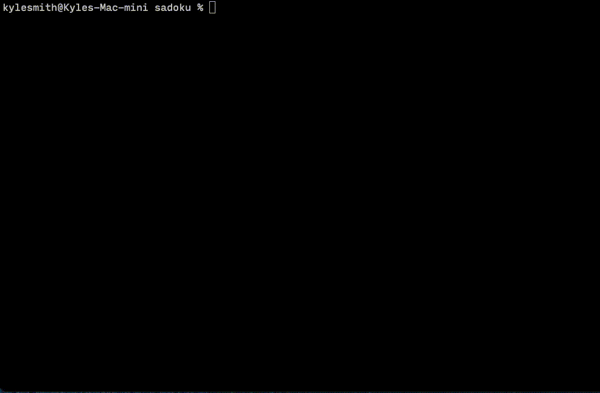

# Sadoku

_(Pronounced like Sudoku with a thick Boston accent.)_

A tiny command-line Sudoku game, written in Rust, using [pancurses].

What it does:

* Renders an editable game state allowing you to solve a sudoku.
* Downloads puzzles from NYTimes by virtue of some very shaky webscraping code.
* Works on my Mac.

What it doesn't do:

* Generate puzzles. Has one hard-coded puzzle I transcribed from NY Times the day I wrote it.
* Tell you when you won.
* Highlight all errors.
* Handle terminals that don't support full color gracefully.

What it should do, but hasn't been tested:

* Work on devices other than my Mac.

[pancurses]: https://crates.io/crates/pancurses

## Demo

## Usage

To run locally, have a Rust development environment and run:

    cargo run --release

Controls are as follows:

* Move cursor: `hjkl` (Like vim).
* Move cursor to next empty/pencilmarked cell: `HJKL`.
* Clear cell: `x`.
* Insert guess: `1` - `9`.
* Insert pencil marks: Shift + `1` - `9`.
* Exit: `q`.
* Download NYTimes puzzle: `d` (warning: this will overwrite any game state)

